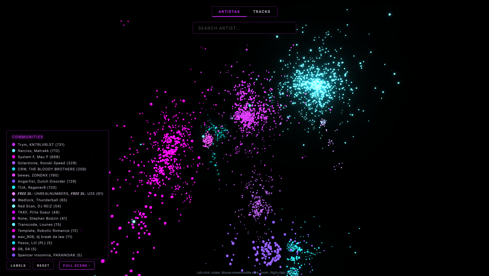
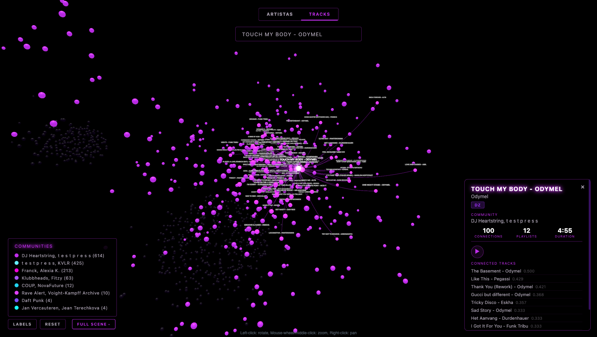

# music-graph

Interactive 3D visualization of the underground electronic music scene, built from playlist co-occurrence data across Deezer and SoundCloud.



## What is this?

**music-graph** maps the connections between artists and tracks in micro-genres that don't exist as formal categories on any platform: **bouncy techno, hard bounce, neo rave, hardgroove, neo trance, eurotrance**, and adjacent sub-genres of acid techno, hard techno, and psytrance.

These scenes are discovered through keyword search, playlist co-occurrence, and artist overlap — not platform taxonomies. The project makes the invisible connections visible.

The end goal is a live graph on [nowarmup.com.ar](https://nowarmup.com.ar).

## How it works

```
Collect → Store → Match → Build Graph → Filter → Layout → Export → Visualize
```

1. **Collect** — BFS expansion from seed keywords across Deezer and SoundCloud. An LLM judge (Gemini) evaluates playlist relevance and assigns tier scores (1-3).
2. **Store** — SQLite via SQLModel. Platform-agnostic canonical entities (Track, Artist) linked to platform-specific sources (TrackSource, ArtistSource).
3. **Match** — Cross-platform deduplication via ISRC, fuzzy matching (RapidFuzz), and MusicBrainz lookups. Same track on Deezer and SoundCloud → one node.
4. **Build Graph** — Bipartite projection: playlists × tracks → weighted co-occurrence edges between artists (or between tracks). Weight algorithms: Jaccard, PMI, cosine, raw count.
5. **Filter** — Pluggable preset system with tier filtering, degree pruning, blocklists, and auto-tightening to fit performance budgets.
6. **Layout** — Community detection (Leiden algorithm) + two-level 3D spring layout: community centers first, then nodes within each community.
7. **Export** — Optimized JSON with integer IDs, pre-computed positions, and LLM-generated community names.
8. **Visualize** — WebGL 3D rendering with bloom, emissive materials, labels, search, and Deezer audio previews.

## Current graph view

The public visualization is currently focused on the artist graph. Track graphs are still exported by the pipeline, but they are no longer exposed in the main UI.

| View | Nodes | Edges mean | Use case |
|------|-------|-----------|----------|
| **Artists** | Artists who appear in playlists together | Weighted by shared playlist frequency | Explore scene structure, find related artists |

The artist graph has three presets:

- **Full Scene** — All playlists up to tier 3. Broadest view.
- **Bounce Focus** — Tier 1-2 playlists only. More focused on core bounce/rave.
- **Core Bounce** — Tier 1 only. The tightest, most relevant cluster.



## Current scale

| Entity | Count |
|--------|-------|
| Playlists | ~1,400 (Deezer + SoundCloud) |
| Tracks | ~77,000 canonical |
| Artists | ~21,000 canonical |
| Artist graph (full-scene) | ~3,500 nodes, 16 communities |
| Track graph (full-scene) | ~3,600 nodes, 30 communities |

## Tech stack

### Backend (data pipeline)

- Python 3.11+, SQLModel (SQLAlchemy + Pydantic), SQLite
- NetworkX for graph construction, igraph + leidenalg for community detection
- Typer CLI, Loguru logging, RapidFuzz for fuzzy matching
- Gemini API for playlist relevance judging and community naming

### Frontend (visualization)

- [3d-force-graph](https://github.com/vasturiano/3d-force-graph) + Three.js for WebGL 3D rendering
- Vite for bundling
- Vanilla JS — no framework, optimized for mobile performance
- Deezer JSONP API for audio previews

## Setup

### Backend

```bash
# Create virtual environment and install
python -m venv .venv
source .venv/bin/activate
pip install -e .

# Copy environment template
cp .env.example .env  # add API keys (Gemini for judging/naming)

# Run a collection batch
music-graph dz-search --max-minutes 15

# Export visualization data
music-graph export-viz all --graph-type all
```

### Frontend

```bash
cd viz
npm install
npm run dev    # → http://localhost:5173
```

### URL parameters

- `?preset=full-scene` / `bounce-focus` / `core-only` — select preset

## Project structure

```
config/                  # seeds.toml, settings.toml
data/                    # SQLite DB, exports (gitignored)
docs/                    # Architecture, research, design guidelines
src/music_graph/
  cli.py                 # Typer CLI commands
  config.py              # Config loader (TOML + .env)
  db.py                  # Engine + session management
  collectors/            # Platform collectors (Deezer, SoundCloud)
  models/                # SQLModel entities
  pipeline/              # Orchestration (collect, build, filter, export)
  graph/                 # Projections, edge weights, export formats
  matching/              # Cross-platform matching (fuzzy, ISRC, MusicBrainz)
  judge/                 # LLM-based relevance judge (Gemini)
viz/
  index.html             # Single-page app
  main.js                # 3D graph rendering + interactions
  style.css              # Neon/rave aesthetic (nowarmup brand)
  public/data/           # Exported graph JSON (gitignored)
```

## Visual identity

Part of the [nowarmup](https://nowarmup.com.ar) brand. Neon-on-black aesthetic: violeta neon `#C02DEB`, rosa neon `#F000D8`, cian electrico `#65EDFA` on pure black `#000000`. Typography: Eurostile (headings) + Inter (body).

## License

Private project.
