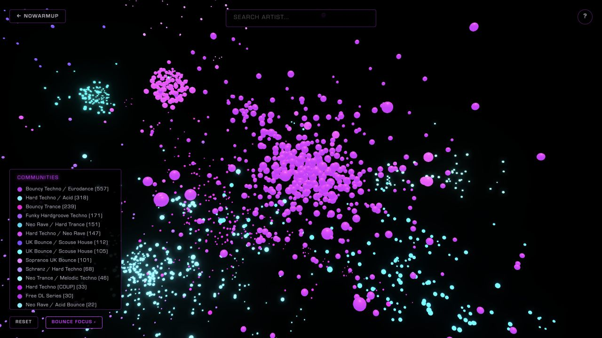
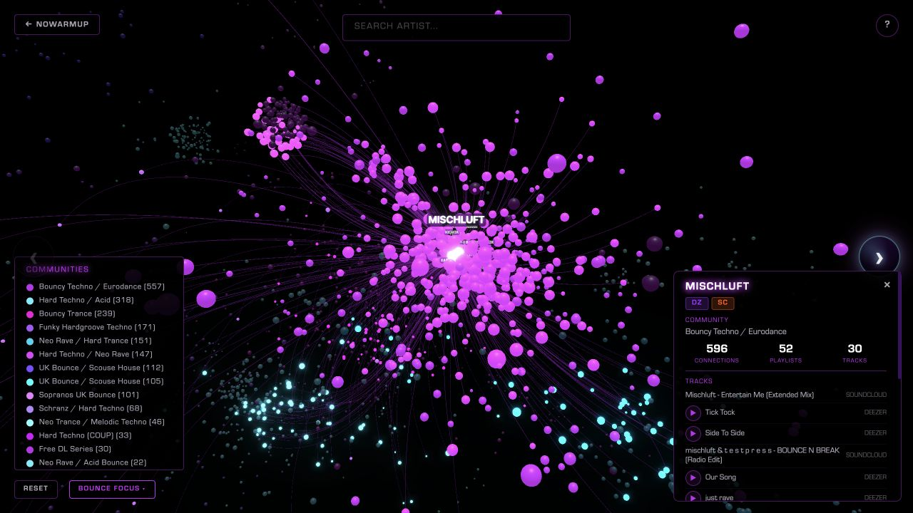

# music-graph

[](https://github.com/PucciRomeroTobias/music-visualizer/actions/workflows/ci.yml)
[](LICENSE)

An interactive map of artist relationships in underground electronic music, built from public playlist co-occurrence data.

**[Open the live visualization](https://www.nowarmup.com.ar/discover/)**



## What this project does

Platform taxonomies do not consistently describe small, overlapping scenes such as bouncy techno, hard bounce, neo rave, hardgroove, and neo trance. This project treats playlists as observations: artists that repeatedly occur in the same playlists become connected in a weighted graph.

The repository contains two related pieces:

- a Python pipeline that collects and normalizes metadata, resolves cross-platform identities, builds weighted graphs, detects communities, and exports visualization data;
- a framework-free Vite frontend that renders the exported artist graph in WebGL with search, community filtering, artist details, and Deezer previews when available.

This is an exploratory map, not an authoritative genre classifier. The result reflects its seeds, available public playlists, collection date, relevance heuristics, and platform coverage. Missing artists and surprising connections are expected.



## Pipeline

```text
Collect → Store → Match → Project → Filter → Layout → Export → Visualize
```

1. **Collect:** ingest playlists and tracks from Deezer or SoundCloud.
2. **Store:** keep canonical entities and platform-specific source records in SQLite through SQLModel.
3. **Match:** deduplicate tracks and artists using ISRCs, normalized names, durations, fuzzy matching, and optional MusicBrainz lookups.
4. **Project:** turn playlist/track membership into weighted artist or track co-occurrence graphs.
5. **Filter:** apply relevance tiers, minimum degree, blocklists, and rendering budgets.
6. **Layout:** detect Leiden communities and pre-compute 3D positions.
7. **Export:** write compact JSON plus an artist-to-track sidecar.
8. **Visualize:** render the fixed layout using `3d-force-graph` and Three.js.

The main UI currently exposes only the artist graph. The repository also keeps an earlier Sigma.js 2D prototype in `viz-sigma/` for comparison.

## Repository layout

```text
config/                  Seed terms and pipeline settings
docs/                    Architecture, research notes, and screenshots
src/music_graph/         Python package and CLI
  collectors/            Deezer, SoundCloud, and Spotify adapters
  graph/                 Projections, edge weights, and exports
  matching/              Cross-platform normalization and resolution
  pipeline/              Collection, graph building, filtering, and viz export
viz/                     Current Three.js visualization
viz-sigma/               Experimental Sigma.js visualization
tests/                   Fast unit tests for matching and graph logic
```

## Requirements

- Python 3.11 or newer
- [uv](https://docs.astral.sh/uv/) for the locked Python environment
- Node.js 22 and npm for the frontend
- A WebGL-capable browser

No credentials are needed to run tests, build either frontend, or explore the bundled synthetic sample. Collection commands have different requirements:

- Deezer's public endpoints do not currently require a key.
- Spotify requires an application client ID and secret. The collector uses a user OAuth flow.
- SoundCloud requires a user-provided OAuth token and client ID for an unofficial API.
- LLM-assisted judging/naming requires local Ollama, `GOOGLE_API_KEY`, or `GROQ_API_KEY`.

Copy `.env.example` to `.env` only when you need those integrations. Never commit that file.

## Quick start

### Explore the bundled sample

```bash
git clone https://github.com/PucciRomeroTobias/music-visualizer.git
cd music-visualizer/viz
npm ci
npm run dev
```

Open `http://localhost:5173/discover/`. The committed six-node dataset is synthetic and exists only to make local development reproducible. The live site uses a separately generated dataset.

### Set up the pipeline

From the repository root:

```bash
uv sync --dev
uv run music-graph --help
```

To initialize an empty database and inspect it:

```bash
uv run music-graph stats
```

Runtime data is written below `data/` and intentionally ignored by Git.

## Collection and export

Review `config/seeds.toml` and `config/settings.toml` before collecting. Network collection can be slow, may be rate-limited, and is designed to run in resumable batches.

Examples:

```bash
# Public Deezer keyword search, capped at 15 minutes
uv run music-graph dz-search --max-minutes 15

# SoundCloud search after configuring .env
uv run music-graph sc-search --max-minutes 15

# Resolve candidate cross-platform matches
uv run music-graph match --entity all --max-minutes 15

# Export every visualization preset and graph type
uv run music-graph export-viz all --graph-type all
```

Generated frontend data is placed under `viz/public/data/`. That directory can contain large derived datasets and source metadata, so only the small synthetic sample is tracked. Review exports before publishing them.

## Development and tests

Run the backend checks:

```bash
uv sync --dev
uv run ruff check src tests
uv run pytest
uv run pip-audit
```

Build and audit the current visualization:

```bash
cd viz
npm ci
npm run build
npm audit
```

The same commands work in `viz-sigma/`. CI runs linting, unit tests, dependency audits, and production builds for both frontends on every pull request and push to `main`.

## Production build and deployment

`viz/vite.config.js` sets the production base path to `/discover/`. Build it with:

```bash
cd viz
npm ci
npm run build
```

Deploy the contents of `viz/dist/` at `/discover/` together with the generated `data/` tree. For another path or root-domain deployment, change Vite's `base` setting before building.

The public demo is served by Vercel as part of the separate nowarmup website, not from this repository. This repository therefore validates deployable artifacts in CI but does not automatically publish the production dataset or site. At the time of the latest verification, the live `bounce-focus` view contained 2,171 artists and 94,973 weighted edges.

## Data, privacy, and platform caveats

- The database and exports are intentionally excluded because they are large, time-dependent derived artifacts and may contain source-platform metadata.
- Do not commit API keys, OAuth tokens, cookies, private playlists, or raw user data.
- The SoundCloud adapter depends on an unofficial API. It can change without notice and may not be appropriate for every account or use case; review current platform terms before using it.
- Playlist relevance and community labels may be assisted by an LLM. Those outputs are heuristic and should be reviewed before publication.
- Deezer previews are requested directly by the browser and depend on Deezer availability and policy.

Please report security issues privately as described in [SECURITY.md](SECURITY.md).

## Contributing

Contributions are welcome. Read [CONTRIBUTING.md](CONTRIBUTING.md) and open a pull request; `main` requires CI and code-owner review.

## License

[MIT](LICENSE) © 2026 Tobias Pucci Romero. Third-party music metadata, artwork, and audio previews remain subject to their respective owners' and platforms' terms.
